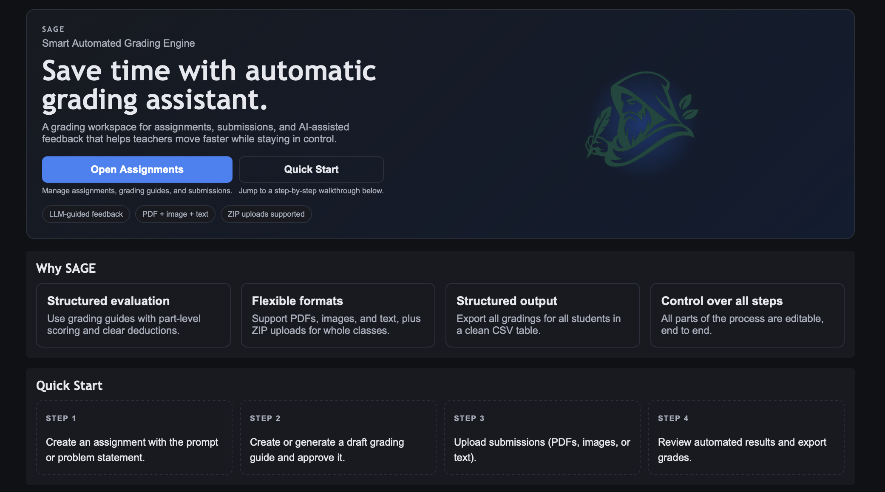

# SAGE (System for Automated Grading & Evaluation)



A minimal grading app. Upload an assignment, create or generate a grading guide, then upload student submissions (PDF/images/text). The system renders PDFs to images, grades automatically in the background, and stores results for review and export.

## Setup

1) Create and activate a virtual environment

```bash
python3 -m venv .venv
source .venv/bin/activate
```

2) Install dependencies

```bash
pip install -r requirements.txt
```

3) Install Poppler (required for PDF rendering)

```bash
brew install poppler
```

Linux options:

```bash
# Ubuntu/Debian
sudo apt-get install -y poppler-utils

# Fedora
sudo dnf install -y poppler-utils

# Arch
sudo pacman -S poppler
```

## Configure Environment

Copy `.env.example` to `.env` and edit as needed:

```bash
cp .env.example .env
```

You can edit settings directly in `.env` or in the web UI (**Settings** in the top bar). Some changes require a restart.

Key variables:
- `LLM_API_KEY`: API key for your OpenAI-compatible provider
- `LLM_API_BASE_URL`: base endpoint (e.g., `https://api.openai.com/v1`)
- `LLM_MODEL`: model name
- `LLM_PROVIDER`: default provider key (`openai`, `custom1`, `custom2`, `custom3`)
- `OPENAI_MODEL_OPTIONS`: comma-separated list for OpenAI model dropdowns
- `CUSTOM_LLM_PROVIDER_1_NAME/2/3_NAME`: display names for custom providers
- `CUSTOM_LLM_PROVIDER_1_API_KEY/2/3_API_KEY`: API keys for custom providers
- `CUSTOM_LLM_PROVIDER_1_API_BASE_URL/2/3_API_BASE_URL`: base endpoints for custom providers
- `CUSTOM_LLM_PROVIDER_1_DEFAULT_MODEL/2/3_DEFAULT_MODEL`: default models for custom providers
- `CUSTOM_LLM_PROVIDER_1_MODELS/2/3_MODELS`: comma-separated model lists per custom provider
- `LLM_USE_JSON_MODE`: set to `1` to force JSON responses (recommended)
- `LLM_MAX_OUTPUT_TOKENS`: max tokens for model responses (helps avoid truncation)
- `LLM_REQUEST_TIMEOUT`: HTTP timeout for LLM requests (seconds)
- `LLM_PRICE_INPUT_PER_1K`: fallback input token price per 1K tokens (used when model is unknown)
- `LLM_PRICE_OUTPUT_PER_1K`: fallback output token price per 1K tokens (used when model is unknown)
- `LLM_IMAGE_TOKENS_PER_IMAGE`: estimated token cost per image for pricing estimates
- `REDIS_URL`: optional; if missing, a local background thread processes jobs
- `MAX_CONTENT_LENGTH`: upload size limit in bytes

## Run Locally

```bash
flask --app app run --debug
```

The app will be available at `http://127.0.0.1:5000`.

## Optional: Redis + RQ

If you have Redis installed and want background workers via RQ:

```bash
redis-server
```

In a separate terminal, run the worker:

```bash
rq worker
```

Make sure `REDIS_URL` is set in `.env`. If Redis is not configured, the app falls back to a local background thread.

## Using the App

1) Create an assignment with title and assignment text.
2) Add a grading guide manually or generate a draft via the LLM. Approve the guide before grading.
3) Upload submissions:
   - Single upload: provide `student_identifier`, optional text, and files.
   - ZIP upload: folders per `student_identifier` with files inside.
4) Jobs are queued automatically after upload (requires an approved guide).
5) Review grading output on the submission detail page.
6) Export grades via the **Export CSV** link on the assignment page.

## Notes

- All uploads and rendered files are stored under `./data/` (gitignored).
- PDF rendering uses `pdf2image` and Poppler.
- LLM responses must be strict JSON; invalid responses are stored as errors.
- Multiple providers can be configured; select provider + model per grading guide and job in the UI.

## License

Apache-2.0. See `LICENSE`.
